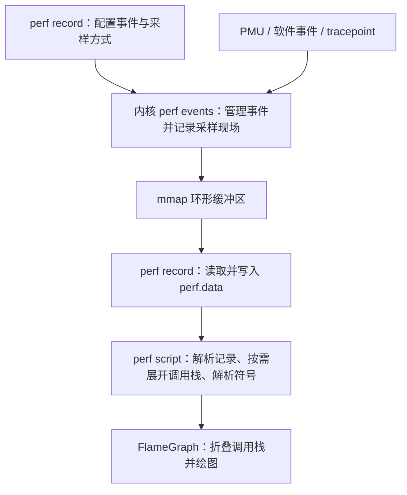

+++
title = "从 perf record 到火焰图：性能数据是如何采集与呈现的"
description = "用数据流串起两种工具，贴合你想把原理讲清楚的目标，也适合工作中查阅。"
date = "2026-08-30"
aliases = ["Tool-perf"]
author = "ChnjFan"
tags = [
    "perf",
    "火焰图",
]
categories = [
    "性能优化",
]
+++

- `perf record` 通过 `perf_event_open()` 配置内核事件。硬件事件通常由 PMU 计数器溢出触发采样，软件事件有相应的软件触发机制。
- `-F99` 设置目标采样频率。对于硬件计数器事件，内核通过调整采样周期接近这个频率，不保证固定间隔，也不保证整个进程每秒恰好产生 99 个样本。
- 内核把记录写入环形缓冲区，用户态 perf 将其保存到 `perf.data`。调用栈还原又分为栈展开和符号化：前者恢复调用关系，后者把地址转换为函数名。
- 火焰图将调用栈折叠、累计权重，再按共同调用路径排列矩形。宽度表示权重占比，纵向表示调用深度，横轴不是时间轴。
- 图的含义取决于事件和权重口径。样本数量、事件量估计、调用次数、CPU 时间和请求延迟不能直接画等号；CPU 采样也不能完整解释阻塞等待。

---

我平时分析 C/C++ 程序的性能，常用 `perf` 采集数据，再看火焰图找热点。这套操作并不陌生，可面试时被问到 `perf` 怎么采集数据、调用栈从哪里来、火焰图又是怎么生成的，我就很难解释清楚。我知道该执行什么命令，也能看着图分析热点，却没弄明白这两步之间的数据是怎么传递和处理的。

这篇文章就以一条常用的 `perf` 命令为线索，把中间的过程梳理清楚。采样得到的**数据如何还原成可供分析的调用栈**，这些**调用栈又如何聚合成火焰图**。

文中的实现说明参考 **Linux v6.12** 源码，寄存器和帧指针的例子按常见的 x86-64 情形展开，其他架构的具体实现可能有所不同。


## 执行 perf 需要什么

```bash
perf record -g -F99 -p <pid> -- sleep 30
```

执行时，需要把 `<pid>` 整体替换成实际进程号。这条命令的几个部分分别描述了采集的不同维度：

| 部分 | 作用 |
|---|---|
| `record` | 采集并保存性能记录，默认输出文件为 `perf.data` |
| `-p <pid>` | 选择一个已经运行的目标进程 |
| `-g` | 启用调用栈记录 |
| `-F99` | 设置目标采样频率为每秒 99 次 |
| `-- sleep 30` | 启动一个持续约 30 秒的命令，以它的结束控制本次采集；被分析的目标仍由 `-p` 指定 |

选项定义可以对照 [Linux v6.12 的 perf record 文档](https://github.com/torvalds/linux/blob/v6.12/tools/perf/Documentation/perf-record.txt)。`sleep` 结束后，`perf` 通过子进程退出信号结束采集循环，相关逻辑在 [builtin-record.c](https://github.com/torvalds/linux/blob/v6.12/tools/perf/builtin-record.c#L664)。

这条命令还没有明确指定采集什么事件。`-F99` 设置的是**目标采样频率**，而 CPU 周期、指令执行和缓存未命中是不同的事件，单看频率无法判断数据代表什么。

原命令没有使用 `-e`，`perf` 会选择默认事件，但最终使用的事件还可能受运行环境影响。例如 v6.12 的 `perf` 在打开 `cycles` 时，如果遇到某些表示事件不受支持的错误，会尝试回退到软件时钟事件，对应逻辑见 [`evsel__fallback()`](https://github.com/torvalds/linux/blob/v6.12/tools/perf/util/evsel.c#L3196)。分析已有数据前，可以先查看文件中实际记录的事件：

```bash
perf evlist -v -i perf.data
```

这条命令只**读取已有的事件配置**，不会重新采样。查看输出中的**事件名称和属性**，就能确认实际采集了什么。[perf evlist 手册](https://man7.org/linux/man-pages/man1/perf-evlist.1.html)

以 CPU 周期等硬件事件的普通采样为例，整个过程可以画成下面这张图：



图中的 perf 是用户态工具，perf events 是内核提供的事件机制，PMU 等是事件来源。火焰图脚本处理的是已经采集好的数据，本身不参与采样。


## perf 什么时候采集样本

### 选择事件和观察方式

PMU（Performance Monitoring Unit，性能监控单元）提供可配置的**硬件计数器**，用来**统计处理器内部的活动**。例如，选择 CPU 周期事件后，计数器就会按照该事件的定义累计计数，用户态的 perf 不需要在每个周期执行一次统计代码。

除了 PMU，perf 还可以使用其他事件来源：

| 来源 | 例子 | 事件来源 |
|---|---|---|
| 硬件事件 | CPU 周期、指令、缓存未命中 | 处理器的性能监控硬件 |
| 软件事件 | 缺页、软件时钟事件 | 内核维护的统计或软件机制 |
| tracepoint | `sched:sched_switch` | 内核中预先设置的跟踪点 |

哪些事件可用，要看处理器、内核和运行环境，具体可参考 [Brendan Gregg 的 perf 事件说明](https://www.brendangregg.com/perf.html#Events)，使用 `perf list` 查看当前环境支持的事件类型。

选择事件后，还可以使用**计数和采样**两种不同的观察方式：
- **计数**关注这段时间内事件一共发生了多少次，`perf stat` 的常见用法就属于这一类。
- **采样**则关注触发采样时程序执行到了哪里，因此需要记录当时的指令位置，必要时还会保存调用栈。

CPU 采样不会逐一记录函数的进入和退出。两个样本之间可能已经执行过许多函数，即使开启 -g，也无法保留这段间隔内的完整调用过程。


### 通过 perf_event_open() 配置内核事件

用户态的 `perf` 通过 `perf_event_open()` 将采集的配置传给内核。这个接口接收 `perf_event_attr` 结构，以及指定线程、CPU 等监控范围的参数。内核据此创建事件，并返回对应的文件描述符。

下面的 C 风格伪代码用于说明各项配置的关系，并非 perf 源码原文。它省略了系统调用封装、错误处理和缓冲区配置：

```c
struct perf_event_attr attr = {0};

attr.size = sizeof(attr);
attr.type = PERF_TYPE_HARDWARE;
attr.config = PERF_COUNT_HW_CPU_CYCLES;

attr.freq = 1;
attr.sample_freq = 99;

attr.sample_type =
    PERF_SAMPLE_IP |
    PERF_SAMPLE_TID |
    PERF_SAMPLE_CALLCHAIN;

fd = perf_event_open(&attr, tid, -1, -1, 0);
```

这段配置使用目标频率模式采集 CPU 周期事件，并在样本中记录指令地址、进程与线程标识、调用链。最后一行把事件绑定到指定线程，不限制它在哪颗 CPU 上运行。这个例子只用于说明接口用法，并不是 `perf record -p` 的完整实现。[perf_event_open 接口说明](https://man7.org/linux/man-pages/man2/perf_event_open.2.html)

对于多线程程序，perf 还需要确定要监控哪些线程。v6.12 的实现会读取 `/proc/<pid>/task`，建立目标进程的线程列表，再据此配置事件。所以，命令行中只指定一个 PID，底层也可能创建多个事件文件描述符。见 [thread_map.c](https://github.com/torvalds/linux/blob/v6.12/tools/perf/util/thread_map.c#L181)。

PMU 不会自动根据 Linux 的 PID 选择统计对象。对于绑定任务的事件，内核要在任务调度时管理事件的运行状态，在线程迁移到另一颗 CPU 后衔接监控。事件绑定到哪个任务或 CPU，以及采样数据如何组织到缓冲区，是两个相关但需要分别理解的问题。[内核对任务与 CPU 采集模式的说明](https://docs.kernel.org/6.12/userspace-api/perf_ring_buffer.html#ring-buffer-for-different-tracing-modes)


### 计数器溢出后，内核如何生成样本

假设每累计一定数量的 CPU 周期就采样一次，这个数量就是采样周期。**在普通硬件事件采样中，内核通过 PMU 驱动配置计数器，使它在计满相应数量后产生溢出通知**。处理器随即发出**性能监控中断**，内核识别发生溢出的事件，并生成样本。

在 Linux v6.12 的 x86 实现中，PMU 中断走 NMI 路径，Intel PMU 的处理代码会把普通计数器溢出交给 `perf_event_overflow()` 等公共逻辑处理。这是该平台上的实现，不能据此认为所有 perf 事件都通过 NMI 采集。相关代码见 [x86 的 NMI 处理入口](https://github.com/torvalds/linux/blob/v6.12/arch/x86/events/core.c#L1734)和 [Intel PMU 的溢出处理](https://github.com/torvalds/linux/blob/v6.12/arch/x86/events/intel/core.c#L2956)。

样本中的指令地址来自被采样的执行现场，而非 perf 中断处理函数自身。若记录的是处理函数的地址，统计到的热点就会变成采样器本身。

不过，记录下来的地址也不一定恰好对应触发事件的那条指令。硬件事件发生到现场被记录之间可能存在偏移，这种偏移通常称为 skid。精确事件采样机制能改善部分场景，但使用普通采样时，不能默认把事件精确归因到某一条指令。[perf_event_open 对 precise_ip 与 skid 的说明](https://man7.org/linux/man-pages/man2/perf_event_open.2.html)


### -F99 与固定间隔采样的区别

`-c` 设置的是事件数量指定采样周期，`-F` 设置的是目标采样频率。对于硬件计数器事件，可以用下面的关系理解频率模式：

```
采样周期 ≈ 事件发生速率 ÷ 目标采样频率
```

假设计数器每秒累计约 19.8 亿次事件，要接近每秒 99 个样本，采样周期就大约是 2,000 万次事件。这是一组用于说明关系的假设数字。内核会根据实际运行情况调整周期，上面的除法并不是完整的反馈算法。

所以，对硬件计数器事件设置 `-F99`，并不意味着给进程安装了一个严格每隔 `1/99` 秒触发的定时器，也不能据此断定采集 30 秒就有 2,970 个样本。线程实际运行了多久、配置了多少个事件实例，以及频率调整、限流和数据丢失，都会影响最终的样本数。

软件时钟事件的实现有所不同。例如，Linux v6.12 中的 `cpu-clock`、`task-clock` 使用高精度定时器采样，代码会把目标频率转换成定时器周期。具体如何触发采样，取决于事件来源；`-F` 表达的是希望达到的频率。[Linux v6.12 软件时钟事件实现](https://github.com/torvalds/linux/blob/v6.12/kernel/events/core.c#L10540)


## 采样数据如何写入 perf.data

### 样本中记录了哪些信息

内核根据事件配置中的 `sample_type` 等属性，决定每个样本要记录哪些字段，并不会保存进程的全部状态。常见字段如下：

| 字段类别 | 回答的问题 |
|---|---|
| 指令地址 IP | 采样时执行到哪里？ |
| PID、TID | 属于哪个进程、线程？ |
| 时间戳、CPU 编号 | 何时、在哪颗 CPU 上采到？ |
| 调用链地址 | 当前执行路径经过哪些调用？ |
| 用户寄存器、用户栈数据 | 后续是否有足够材料恢复调用栈？ |
| 采样周期 | 这个样本对应的采样周期是多少？ |

一个样本不一定包含上表中的所有字段。特别是调用链地址与用户栈快照，它们服务于不同的栈展开方式，不能简单视为同一种数据。[Linux v6.12 的采样记录定义](https://github.com/torvalds/linux/blob/v6.12/include/uapi/linux/perf_event.h)

内核将这些字段组织成带有类型和长度的记录，再交给输出路径处理。此时的数据主要还是地址、标识和数值，火焰图中的函数矩形要经过后续处理才能生成。

### 环形缓冲区传递采样数据

采样路径对开销和执行环境都有严格要求。如果每生成一个样本就直接写入磁盘文件，文件系统操作和存储延迟就会影响采样过程。perf 用环形缓冲区将采样和文件写入分开。

内核分配缓冲区，用户态的 perf 通过事件文件描述符调用 `mmap`，与内核共享这块缓冲区。在这里讨论的普通非覆盖模式下，可以把内核看作生产者，把用户态的 perf 看作消费者：

```
内核：写入采样记录 → 发布 data_head
                         ↓
                    共享环形缓冲区
                         ↓
perf：读取已有记录 → 更新 data_tail
```

`data_head` 告诉用户态已经发布到哪里，`data_tail` 告诉内核用户态已经消费到哪里。这两个字段的读写还要遵守并发和内存顺序约束，不能当作普通变量随意操作。[内核环形缓冲区文档](https://docs.kernel.org/6.12/userspace-api/perf_ring_buffer.html#accessing-buffer)


`mmap` 让内核与用户态共享这段缓冲区，但不代表整个采集过程都是“零拷贝”。从缓冲区读取记录后，perf 仍需要把它们写入文件。

如果用户态消费不及时，普通非覆盖模式的缓冲区可能没有足够空间容纳新记录。这时会丢失记录，内核累计丢失数量，等能够输出时再通过相应记录报告。内核不会为了保住每个样本而一直等待用户态腾出空间。[Linux v6.12 的缓冲区空间检查与丢失记录处理](https://github.com/torvalds/linux/blob/v6.12/kernel/events/ring_buffer.c#L189)


### perf.data 保存了什么

用户态的 `perf record` 持续读取缓冲区，并将数据写入文件。在 Linux v6.12 源码中，可以从 `record__mmap_read_all()` 查看读取流程，从 `record__write()` 查看文件写入操作。[perf record 的读取与写入实现](https://github.com/torvalds/linux/blob/v6.12/tools/perf/builtin-record.c#L248)。

只记下某个线程在地址 `0x...` 处被采到，还不足以在离线分析时定位对应的代码。程序可能加载动态库，不同程序也可能使用相同的虚拟地址，因此还需要知道这个地址在采样时属于哪个映射、哪个二进制文件。为此，`perf.data` **除了样本，还会保存程序映射、进程名称、事件属性**等辅助信息和元数据。

例如，`PERF_RECORD_MMAP`、`PERF_RECORD_MMAP2` 记录可执行映射信息，供后续解析地址时使用。这里记录的是目标程序的地址映射，上一节的 `mmap` 则用于让用户态访问 perf 的数据缓冲区，两者用途不同。[Linux v6.12 的映射记录定义](https://github.com/torvalds/linux/blob/v6.12/include/uapi/linux/perf_event.h)

采样现场的数据已经保存到文件中，但要把其中的地址还原成可读的调用栈，还需要两步处理。


## 如何还原 C/C++ 程序的调用栈

### FP 模式：沿帧指针寻找调用者

假设采样时，程序正在执行下面这条调用路径：

```
main → handle → parse
```

采样得到的指令地址对应 `parse` 中的位置。要知道它由 `handle` 调用，还需要恢复调用者的信息，这个过程称为栈展开（stack unwinding）。

在保留常规帧指针链的 x86-64 代码中，可以从当前的帧指针寄存器 RBP 出发，找到上一帧的帧指针和返回地址。典型栈帧可以简化为：

```
当前 RBP
   │
   ├── [RBP]     ：上一帧的 RBP
   └── [RBP + 8] ：返回到调用者的地址
```

读取返回地址，就能找到调用者的位置。再沿着保存的上一帧 RBP 继续查找，就能找到更上层的调用者。这幅图只描述常规栈帧建立后的布局，并不适用于所有编译结果和函数执行位置。

Linux v6.12 的 x86 `perf_callchain_user()` 会先保存现场的指令地址，再检查并读取用户栈帧。其中，保存返回地址并转到上一帧的代码是：

```c
perf_callchain_store(entry, frame.return_address);
fp = (void __user *)frame.next_frame;
```

这两行节选自 [Linux v6.12 源码](https://github.com/torvalds/linux/blob/v6.12/arch/x86/events/core.c#L2911)。完整函数还要处理安全读取、栈深度限制等条件，仅凭这两行无法实现完整的栈遍历。

在这条 **FP 采集路径中，内核在采样时就展开并记录了用户态调用链**，后续工具处理的是已经保存的调用链地址。

这种方式依赖机器代码中可用的帧指针链。编译器优化可能省略帧指针，程序调用的库也可能没有保留它。`-fno-omit-frame-pointer` 可以影响编译器是否保留帧指针，但 GCC 明确说明，这个选项并不保证所有目标平台上的所有函数都使用帧指针。[GCC 的帧指针选项说明](https://gcc.gnu.org/onlinedocs/gcc/Optimize-Options.html#index-fomit-frame-pointer)

因此，即使通过 `perf record -g` 开启了调用栈记录，采到的调用栈仍可能不完整。

没有额外配置覆盖时，用户态调用栈默认采用 FP；使用 `--call-graph dwarf` 可选择 DWARF

### DWARF 模式：先保存现场，再展开调用栈

没有可用的帧指针链时，还可以借助编译器生成的调用帧信息，即 CFI（Call Frame Information）。CFI 描述了在相应的指令位置，如何根据寄存器和栈内存恢复调用者状态，让展开器不必完全依赖固定的 RBP 链。

perf 的 DWARF 模式把采集和展开放在两个阶段完成：

| 阶段 | 用户态调用栈相关工作 |
|---|---|
| 采集时 | 保存用户寄存器和一定大小的用户栈快照 |
| 后处理时 | 根据保存的现场和对应二进制中的展开信息，恢复调用者序列 |

Linux v6.12 的 perf 会为 DWARF 模式设置用户寄存器和用户栈采样字段，同时关闭普通的用户态调用链采集。对应配置见 [__evsel__config_callchain()](https://github.com/torvalds/linux/blob/v6.12/tools/perf/util/evsel.c#L894)。

后处理时，以 libdw 后端为例，展开器用样本中保存的寄存器建立初始状态，从栈快照中读取所需内存，再逐层恢复栈帧。它使用的是采样时留下的数据，不会在分析时重新读取已经变化的目标线程现场。见 [unwind-libdw.c](https://github.com/torvalds/linux/blob/v6.12/tools/perf/util/unwind-libdw.c#L183)。

因此，在这里的实现中，DWARF 用户态栈展开发生在后处理阶段，并不是在采样中断里完成的。

DWARF 模式也不能保证调用栈完整。栈快照的大小有限，如果展开需要读取快照范围之外的栈内容，就可能提前结束。展开信息缺失、二进制不匹配，也会影响结果。使用这种模式还需要 perf 在构建时具备相应的展开库支持。[perf record 的调用栈模式说明](https://github.com/torvalds/linux/blob/v6.12/tools/perf/Documentation/perf-record.txt)

用于栈展开的规则，与变量名、源码行号等调试信息也需要分开理解。没有加编译器的 -g，不能据此判断程序没有展开信息；GCC 还提供了独立生成展开表的选项。[GCC 的展开表选项](https://gcc.gnu.org/onlinedocs/gcc/Code-Gen-Options.html#index-fasynchronous-unwind-tables)


### 符号化：把地址转换成函数名

无论使用 FP 还是 DWARF，展开得到的主要都是一串代码地址。要把它们显示成 `main → handle → parse`，还需要符号化。

对于用户态代码，这个过程可以分为三步：

1. 根据采样时的映射信息，确定地址属于哪个可执行文件或共享库。
2. 结合加载位置和文件布局，把运行时地址换算成对象文件中的对应地址。
3. 查找符号，确定这个地址落在哪个函数范围内。

ELF 符号表包含符号名称、值、大小和类型等信息，工具可以据此建立函数地址与名称之间的对应关系。[ELF 符号表规范](https://refspecs.linuxfoundation.org/elf/gabi4%2B/ch4.symtab.html)

解析时还需要找到匹配的文件。同一路径下的程序如果重新编译过，地址布局可能已经改变。build ID 可以帮助工具识别二进制版本，独立调试文件也可以与对应的二进制文件关联。[GDB 对 build ID 与独立调试文件的说明](https://sourceware.org/gdb/current/onlinedocs/gdb.html/Separate-Debug-Files.html)

排查异常调用栈时，也要分开检查栈展开和符号化：

- 栈展开失败时，可能只能恢复一部分调用链，找不到更上层的调用者。
- 符号化失败时，可能已经有了地址，却无法解析成函数名，因此显示地址或 `[unknown]`。

两种问题可能同时出现，需要分别检查调用链数据和符号解析所需的文件，不能只靠补上一个 `-g` 解决。编译器的 `-g` 用于生成调试信息，perf 的 `-g` 用于开启调用栈记录，两者作用于不同阶段。[GCC 调试选项说明](https://gcc.gnu.org/onlinedocs/gcc/Debugging-Options.html)


### 为什么调用栈可能与源码不同

即使栈展开和符号化都正常，优化后的机器代码也未必保留源码中的每一层独立调用。

函数内联后，可能不再有对应的物理栈帧；尾调用优化也可能改变能观察到的调用链。借助调试信息和工具支持，可以显示部分逻辑调用关系，但源码中存在一次调用，并不意味着运行时一定有一层独立栈帧。[GCC 的内联与尾调用优化选项](https://gcc.gnu.org/onlinedocs/gcc/Optimize-Options.html)

前面对 FP 和 DWARF 的比较主要针对用户态调用栈。内核调用栈的展开方式取决于内核自身的配置，例如 x86 上可以使用 ORC。选择 `--call-graph dwarf` 并不会把内核调用栈也切换到同一套展开方法。[perf record 对用户态与内核展开方式的区分](https://github.com/torvalds/linux/blob/v6.12/tools/perf/Documentation/perf-record.txt)

一条带函数名的采样调用栈，涉及前面几个环节的配合。事件决定何时记录现场，采集方式决定保存哪些数据，展开器恢复调用者序列，符号化再把代码地址转换成函数名。火焰图脚本接着将大量这样的调用栈聚合成图，用来观察热点分布。


## 调用栈文本如何变成火焰图

前面已经解释了采样记录和调用栈从哪里来。从 `perf.data` 生成火焰图，需要经过三个转换步骤：

```
perf.data
    │ perf script
    ▼
多行调用栈文本
    │ stackcollapse-perf.pl
    ▼
调用路径 + 累计权重
    │ flamegraph.pl
    ▼
SVG 火焰图
```

这三个步骤可以分开执行，并保留各自的中间文件。图看起来不对时，就能沿着这些文件逐步检查，找到问题出在哪一步，而不必只对着最终的矩形猜测。本节以 FlameGraph 的提交 [41fee1f](https://github.com/brendangregg/FlameGraph/tree/41fee1f99f9276008b7cd112fca19dc3ea84ac32) 为准，避免混用不同版本的实现细节。


### perf script：把采样记录转换成调用栈文本

读取已有的采集文件，可以执行：

```bash
perf script -i perf.data \
  -F comm,pid,tid,time,event,ip,sym,dso \
  > perf.stacks.txt
```

这里的 -F 指定输出字段，含义与 perf record -F99 中的采样频率不同。这些字段依次是进程名称、进程与线程标识、时间、事件、指令地址、符号和所属对象文件。[perf script 手册](https://man7.org/linux/man-pages/man1/perf-script.1.html)

本节按**每条样本计 1** 的口径处理，因此没有输出 period 字段。下一小节会解释这个选择为什么重要。

下面是一条简化的模拟输出：

```
demo 1234/1234 [000] 1.000000: cycles:u:
    401300 parse+0x10 (/synthetic/demo)
    401100 handle+0x10 (/synthetic/demo)
    401000 main+0x10 (/synthetic/demo)
```

地址、时间和进程号都是占位，不是实测结果。这条记录表示，采样时程序正在执行 `parse`，它的调用者依次是 `handle` 和 `main`。

`perf script` 处理的是已经保存的现场数据。在 DWARF 模式下，它需要根据保存的寄存器、栈快照等信息展开用户态调用栈，再结合符号信息输出函数名。这个过程不会对正在运行的程序重新采样。


### 栈折叠：合并重复的调用路径

同一条调用路径可能出现在多条样本中。绘图前，可以先把这些重复路径合并。例如，上一节的记录可以转换成一条从根到叶的路径：

```
demo;main;handle;parse 1
```

分号分隔调用层级，末尾的数字表示权重。最前面的 `demo` 是进程名称，不是一层函数调用。

假设构造了 10 条模拟样本：
- 5 条经过 `main → handle → parse`；
- 3 条经过 `main → handle → encode`；
- 2 条经过 `main → background → parse`。

折叠后得到：

```
demo;main;background;parse 2
demo;main;handle;encode 3
demo;main;handle;parse 5
```

这三行就可以作为绘图输入，不必再保留 10 条样本各自的多行调用栈。脚本用哈希表累计路径权重，核心操作是：

```perl
$collapsed{$stack} += $count;
```

这行代码是在 [stackcollapse-perf.pl](https://github.com/brendangregg/FlameGraph/blob/41fee1f/stackcollapse-perf.pl) 中截取的。


**累计权重未必就是样本数**。在本节使用的版本中，脚本会读取输入中的 `period`，有有效值时按该值累计，没有时才按 1 累计。这组模拟数据的验证结果是：不带 `period` 时，权重为 2、3、5；给每条记录加入 `period=2` 后，权重变成 4、6、10。所以，输出末尾的整数是否表示样本数，要看脚本实际使用了什么权重。

脚本聚合时使用的是处理后的路径标签，其中的函数偏移和部分签名信息会被清理。分析 C++ 重载函数或不同模块中的同名符号时，应保留原始输出，以免清理后的名称掩盖了这些区别。


### 绘图：调用路径如何变成上下相接的矩形

折叠后的三行数据，可以整理成一棵带权重的调用树：

```
demo                         10
└── main                     10
    ├── background            2
    │   └── parse             2
    └── handle                8
        ├── encode            3
        └── parse             5
```

经过 `handle` 的两条路径分别有 3 个和 5 个样本，因此它的权重是 8。两个 `parse` 虽然同名，但一个由 `background` 调用，另一个由 `handle` 调用，属于不同的调用路径，因此显示为两个矩形。

没有额外筛选时，一个矩形的逻辑宽度可以表示为：

```
矩形宽度 = 可用绘图宽度 × 该调用路径的累计权重 / 总权重
```

这张实际生成的 SVG 每个函数计算占比后的结果：


图中的 `all` 是绘图器补入的总根节点，`demo` 是进程标签，都不代表额外的函数调用。这 10 个样本只用于演示布局，不能据此判断真实热点是否稳定。

可以用前缀树理解图中的结构。`flamegraph.pl` 实际绘图时，会先对折叠后的路径排序，再比较相邻路径的共同前缀，保留共同部分，并分别计算分叉部分的范围。矩形的纵向位置由栈深度决定，横向位置和宽度则根据累计权重计算。[绘图脚本的 `flow()` 与布局实现](https://github.com/brendangregg/FlameGraph/blob/41fee1f99f9276008b7cd112fca19dc3ea84ac32/flamegraph.pl#L597)

聚合后的图不再保留原始时间顺序，因此，横向相邻的两个矩形并不表示两次调用在时间上相邻。


## 火焰图能告诉我们什么，又遗漏了什么

### 看热点之前，先确认宽度代表什么

读火焰图时，需要先确认采集的事件和累计权重的方式。

| 输入口径 | 宽度直接表示什么 |
|---|---|
| 每条样本计 1 | 该调用路径在保留样本中的出现占比 |
| 按采样 `period` 累计 | 该调用路径对应的估算事件量，占总估算事件量的比例 |

例如，同样按 `period` 加权，`cycles` 数据和缓存未命中数据描述的也是不同的开销，不能因为画法相同就作相同解释。

有代表性的 CPU 时间采样，可以帮助估计 CPU 时间花在了哪里。但这个判断依赖采样事件、频率控制和数据质量，不能把所有 perf 火焰图都当作“函数耗时图”。

普通火焰图中的视觉元素可以这样理解：

- 宽度与当前统计口径下的累计权重成比例。
- 纵向位置表示调用栈深度。
- 横向位置由聚合布局决定，不表示执行时间。
- 颜色通常用于区分相邻帧，具体含义取决于配色方案，不能默认认为“越红越慢”。

横轴是否保留时间顺序，也是火焰图与 flame chart 的一项区别。flame chart 保留时间顺序，普通火焰图则对调用栈进行聚合排列。[Brendan Gregg 对 CPU 火焰图的说明](https://www.brendangregg.com/flamegraphs.html)


### 父函数很宽，不等于自身开销很大

回到前面的模拟数据，`handle` 占整张图的 80%。但这 8 个样本的叶子都是 `parse` 或 `encode`，没有一个直接落在 `handle` 自己的指令上。

在这组完整且无递归的示例样本中：

```
handle 的包含子调用权重 = 8
handle 的自身权重       = 8 - 5 - 3 = 0
```

这表示当前样本没有直接观察到 `handle` 自身的执行，不能证明它的真实自身开销严格为零。

也不能把 `handle` 的 80% 与两个子函数的 30%、50% 相加，得出 160%。同一个样本会经过调用栈中的多个层级，父子矩形包含的数据有重叠。

比较 `perf report` 与火焰图时，同样需要对齐统计口径。`perf report` 的常见开销计算会累计样本的 `period`，而本文按样本数绘图，两者的百分比未必相同。还要确认比较的是 `Self` 还是包含子调用的开销，以及过滤范围是否一致。[`perf report` 的开销计算说明](https://man7.org/linux/man-pages/man1/perf-report.1.html)


### 等待分析和优化验证，还需要其他数据

假设一个线程只执行了少量计算，随后便阻塞等待 I/O。等待期间，它没有持续在 CPU 上执行指令，普通的任务 CPU 周期采样也就不会按等待时长持续采到它。

即使等待占了请求的大部分时间，CPU 火焰图仍可能主要展示那一小段计算。整张图的横向宽度是采集数据归一化后的结果，不代表请求从开始到结束的全部时间。

分析等待，需要额外的调度、阻塞或时间信息。perf 也提供独立的 off-CPU 采集能力，但它使用另一套数据来源和权重定义，无法直接从这里的 CPU 周期样本中还原出来。[perf record 的 off-CPU 选项说明](https://github.com/torvalds/linux/blob/v6.12/tools/perf/Documentation/perf-record.txt)

根据火焰图采取优化动作前，还需要检查：

- 样本量是否足够，是否覆盖了有代表性的业务阶段；
- 是否存在丢样、调用栈截断或大量未知符号；
- 数据是否只包含某些线程、某类事件或用户态执行；
- 提高采样频率、复制更多栈数据，是否明显干扰了目标程序。

`perf script --show-lost-events` 可以显示文件中的丢失事件记录。但没有看到这类记录，并不能证明所有采集和解析环节都没有损失。[perf script 手册](https://man7.org/linux/man-pages/man1/perf-script.1.html)

火焰图能帮助我们选择下一步检查的位置。某个函数变窄后，仍要在相同负载下，用 CPU 消耗、吞吐或延迟等指标验证优化效果。占比下降，不代表绝对开销也下降了。

## 写在最后

现在我们就可以从容的回答perf 底层如何采集数据，火焰图又如何生成的。

`perf record` 采样先通过 `perf_event_open()` 向内核配置事件、监控范围、采样频率和需要保存的字段。

以普通硬件事件采样为例，PMU 负责计数，计数器溢出后触发硬件中断，内核在中断上下文中从寄存器和栈内存中采样当前执行函数的相关信息。`-F99` 是目标频率，内核会调整采样周期，不代表整个进程严格每秒产生 99 个样本。采样记录通过**共享环形缓冲区 Ring Buffer**交给用户态 perf，再保存为 `perf.data`。

调用栈还原要区分**展开和符号化**。FP 模式通常在采样时沿帧指针（BP 寄存器）记录用户态调用链；DWARF 模式保存寄存器和栈快照，随后在用户态展开。`perf script` 再把地址转换成函数名进行符号化输出。

生成火焰图时，先用 `perf script` 输出调用栈，再折叠相同路径、累计权重，最后按照共同调用前缀绘制矩形。宽度取决于输入权重，纵向是栈深度，横轴不是时间轴。解释结果之前，还要确认事件、计数口径和数据完整性。

